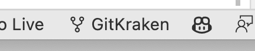
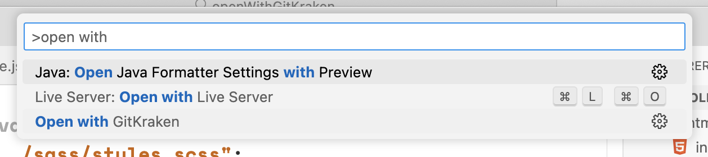

# Open with GitKraken

An extension to open the current project folder in GitKraken. If a workspace is open, all folders within will be opened in GitKraken.

## Features

The extension adds the following to VS Code:
- a shiny new button to the status bar that opens the current project folder in GitKraken

> 

- a new command to the Command Palette (Ctrl+Shift+P) called "Open with GitKraken" that opens the current project folder in GitKraken

> 

Selecting either will open up your current project folder in GitKraken. It does this by executing the following shell command:
```
gitkraken -p [path to project folder]
``` 
The extension will display error messages if: 
- a project / workspace is not currently opened 
- GitKraken is not installed

**Enjoy!**